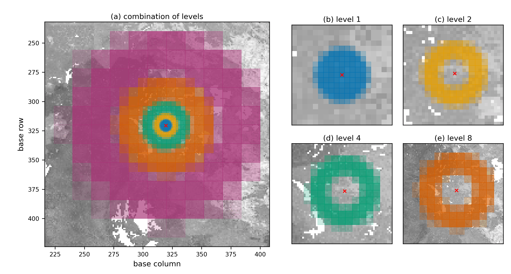

<h1><a name="top"></a>connectivity: a multi-resolution landscape connectivity algorithm</h1>

- [Installation ](#installation-)
  - [Create or Load a Python Environment ](#create-or-load-a-python-environment-)
  - [Compile and Install the Rust Library ](#compile-and-install-the-rust-library-)
- [Connectivity Analysis ](#connectivity-analysis-)
  - [Connected Habitat (Connectedness) ](#connected-habitat-connectedness-)
  - [PARC-Connectedness ](#parc-connectedness-)
  - [Bioclimatic Ecosystem Resilience Index (BERI) ](#bioclimatic-ecosystem-resilience-index-beri-)
- [Running Analysis with Tiles ](#running-analysis-with-tiles-)
- [Citation](#citation)
      
A multi-resolution landscape connectivity algorithm for calculating ***Habitat Connectivity (Connected-Habitat)***, ***PARC Connectedness*** and the ***Bioclimatic Ecosystem Resilience Index (BERI)***.

This algorithm operates on the overview layers of raster files which are now generated on-the-fly.

## Installation <a name="install"></a>     
### Create or Load a Python Environment <a name="env"></a>     
You need to load the Python module and create an environment if you don't already have one. If you already have an environment with `numpy`, `rasterio`, `geopandas`, and `shapely`, ignore this step and just activate your environment.

```bash
module load python/3.12.3
```

```bash
python -m venv ~/myenv
```
Installing the library into the environent:

```bash
source ~/myenv/bin/activate

# To make the virtual environment explicitly include system site packages, use:
python -m venv ~/myenv --system-site-packages
```

### Compile and Install the Rust Library <a name="rust"></a>     

1- Navigate to the repo:
```bash
cd ~/connectivity
```

2- Load the Rust module on HPC:

```bash
module load rust/1.92.0
```
For local installation, you need to install Rust on your system.

3- Complie and install the library:

Use the following to build a wheel:

```bash
maturin build --release
```

4- Install the wheel with `pip`:

```bash
pip install target/wheels/connectivity-*.whl
```

## Connectivity Analysis <a name="analysis"></a>     
Resolve the bundled example paths once so they can be reused throughout the
analysis:

```python
from connectivity import beri, connectedness, example_data_path, resolution_info

condition_file = example_data_path("site_condition")
pa_file = example_data_path("pa_proportion")
current_file = example_data_path("transgrids/1990")
future_files = [
    example_data_path("transgrids/IPS50_45"),
    example_data_path("transgrids/GFD50_85"),
]
```

To bound the spatial extent of the connectivity calculation, the algorithm limits how far it searches across neighboring cells in the condition raster. The approximate one-sided search reach is computed as:
`max_reach = outer_window * max(levels) * resolution`. For example, with a 1 km resolution raster, a max-level of 32, and an `outer_window` of 11, the resulting search reach is:
      
```text
distance = outer_window × max_level × resolution
         = 11 × 32 × 1 km
         = 352 km  
```    

Use `resolution_info()` to preview how candidate `levels` will change raster
dimensions and approximate search reach before running the analysis:

```python
resolution_info(condition_file, outer_window=9)
```

```text
File: .../connectivity/data/site_condition.tif
Base raster: 588 x 516 cells (303.41K total)
Base resolution: 0.008333 degrees
CRS: EPSG:4326
Bands: 1
Data type(s): float32
Nodata: -9999.0
Outer window: 9
Small-dimension warning threshold: < 16 cells
Distance note: approximate km values use centre latitude -41.550

Candidate internally generated levels:
  Level    Width   Height      Cells   % base           Resolution            Reach     Reach km  Note
      1      588      516    303.41K 100.000%     0.008333 degrees    0.075 degrees     8.349 km
      2      294      258     75.85K  25.000%      0.01667 degrees     0.15 degrees      16.7 km
      4      147      129     18.96K   6.250%      0.03333 degrees      0.3 degrees      33.4 km
      8       74       65      4.81K   1.585%      0.06667 degrees      0.6 degrees     66.79 km
     16       37       33      1.22K   0.402%       0.1333 degrees      1.2 degrees     133.6 km
     32       19       17        323   0.106%       0.2667 degrees      2.4 degrees     267.2 km
     64       10        9         90   0.030%       0.5333 degrees      4.8 degrees     534.3 km  small grid; review
    128        5        5         25   0.008%        1.067 degrees      9.6 degrees     1.07K km  small grid; review
    256        3        3          9   0.003%        2.133 degrees     19.2 degrees     2.14K km  small grid; review
    512        2        2          4   0.001%        4.267 degrees     38.4 degrees     4.27K km  small grid; review
```

The default `window_mode="circular"` uses source-centered circular annuli with
fractional area/count support at annulus boundaries. The
`window_mode="square"` option uses the same source-centered fractional
construction with square annuli. These modes change indicator values, so
compare outputs only between runs that use the same window mode.



Each coloured neighbourhood represents a different raster aggregation level.
Fine levels capture nearby cells at higher resolution, while coarser levels
extend the search over larger distances. Their contributions are combined into
a single graph, in which the least-cost path from the focal cell is calculated
for each aggregated cell.
See [Valavi et al. (2026)](https://doi.org/10.32942/X2S68V) for the full method.

### Connected Habitat (Connectedness) <a name="conn"></a>    

To compute connected-habitat (or plain connectedness), you only need a habitat condition raster. Use `option` argument to generate the connected-habitat from connectedness and input condition with:    
1. `connectedness`
2. `connectedness * condition`
3. `sqrt(connectedness * condition)` — geometric mean (default)

```python
connd = connectedness(
    condition_file = condition_file,
    lambdas = [2, 20, 200],
    max_cost = 2.0, 
    window_size = 5, 
    outer_window = 11,
    window_mode = "circular",
    levels = [2, 4, 8, 16, 32], 
    option = 3,
    filename = "./results/connected_habitat.tif"
)
```


#### Optional resistance surface

By default the habitat condition raster does double duty: it weights how costly each cell is to
move through **and** supplies the habitat value used in the indicator. Pass an optional
`resistance_file` to **decouple** these two roles. The resistance raster (values in `[0, 1]`,
higher = harder to cross, scaled with `resistance_scale`) then drives **only** the least-cost path
traversal, while condition still supplies the habitat value:

```python
connd = connectedness(
    condition_file = condition_file,
    resistance_file = resistance_file,   # optional; decoupled movement-cost surface
    resistance_scale = None,             # divide resistance into [0, 1] if needed
    max_cost = 2.0,
    window_mode = "circular",
    levels = [2, 4, 8, 16, 32],
)
```

The edge weight becomes `w = (1.0 - max_cost) * (1 - resistance) + max_cost`, so `resistance = 0`
is free (`w = 1`) and `resistance = 1` is the most costly (`w = max_cost`). When `resistance_file`
is omitted, condition is used for traversal as before, and the output is unchanged. Cells valid in
condition but missing a resistance value fall back to condition for traversal and raise a warning,
so the analysis domain is never changed silently. The same `resistance_file` / `resistance_scale`
arguments are available on `beri()`.

### PARC-Connectedness <a name="parc"></a>     
To compute PARC-connectedness, provide both:
* a habitat condition raster, and
* a protected-areas proportion raster.    
     
When `pa_file` (proportion of protected-areas in each cell) is supplied, the function automatically returns PARC-connectedness instead of standard connectedness.

```python
parcc = connectedness(
    condition_file = condition_file,
    pa_file = pa_file,
    lambdas = [2, 20, 200],
    max_cost = 2.0, 
    window_size = 5, 
    outer_window = 11,
    window_mode = "circular",
    levels = [2, 4, 8, 16, 32], 
    filename = "./results/parc_connectedness.tif"
)
```


Use `pixel_coverage()` when you need the proportion of each raster pixel covered
by polygon geometry. The calculation is backed by a performant Rust
implementation:

```python
from connectivity import pixel_coverage

coverage = pixel_coverage(
    "./data/polygons.gpkg",
    condition_file,
)
```

### Bioclimatic Ecosystem Resilience Index (BERI) <a name="beri"></a>    
To compute BERI, you must provide:
* a condition raster
* current GDM transgrids
* one or more future transgrids scenarios (as a list)

```python
beris = beri(
    condition_file = condition_file,
    current_file = current_file,
    future_files = future_files,
    lambdas = [2, 20, 200], 
    max_cost = 2.0, 
    window_size = 5, 
    outer_window = 11,
    window_mode = "circular",
    levels = [2, 4, 8, 16, 32],
    filename = "./results/berri.tif"
)
```


## Running Analysis with Tiles <a name="tiles"></a>    

To run the model using tiles, create a rectangular tile polygon as a GeoDataFrame
and pass it to the `polygon_mask` argument. This limits data loading to only the
portion required for the tile, i.e. the output core plus the internally buffered
neighborhood.

Use `make_tile()` to generate non-overlapping output-core tiles whose internal
boundaries align with the coarsest aggregation level. This is preferred over
creating overlap-expanded tile polygons externally. Be sure to set
`closed_border = False` (the default) so that neighborhood information is
included around each tile core.

```python
from connectivity import connectedness, make_tile

levels = [2, 4, 8, 16, 32]

tile_id = 0
tile_poly = make_tile(
    raster_file = condition_file,
    nrows = 4,
    ncols = 4,
    tile_id = tile_id,
    align_to = max(levels),
)

connd = connectedness(
    condition_file = condition_file,
    polygon_mask = tile_poly,
    closed_border = False,
    margin_px = 32,
    lambdas = [2, 20, 200],
    max_cost = 2.0, 
    window_size = 5, 
    outer_window = 11,
    window_mode = "circular",
    levels = levels, 
    option = 1,
    filename = f"./results/connected_habitat_tile_{tile_id}.tif"
)
```

For large, uneven workloads, use balanced tiles:

```python
tile_poly = make_tile(
    raster_file = condition_file,
    nrows = 4,
    ncols = 4,
    tile_id = tile_id,
    align_to = max(levels),
    balanced = True,
    io_weight = 0.1,
)
```

Balanced tiling uses a deterministic raster-mask cost estimate while preserving
the same `align_to` boundary alignment. It is useful for global rasters where
some tiles contain mostly ocean or nodata and others contain many valid land
pixels. Use `balanced = False` (the default) when equal aligned tiles are enough.
When `balanced = False`, `io_weight` is ignored.

## Citation
To cite `connectivity` library in publications and reports, please use:

Valavi, R., Mokany, K., Ware, C., Vickers, M., Giljohann, K. M., & Ferrier, S. (2026). **A scalable multi-resolution framework for connectivity-based biodiversity indicators**. *EcoEvoRxiv*. [https://doi.org/10.32942/X2S68V](https://doi.org/10.32942/X2S68V)

[Back to top!](#top)
