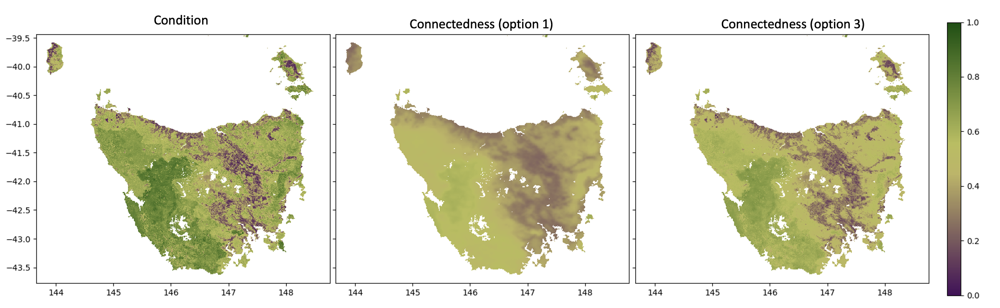
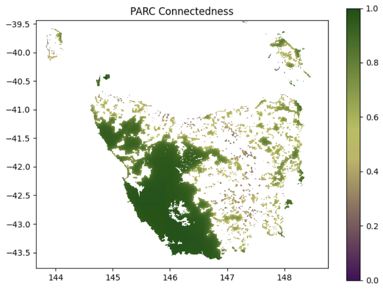
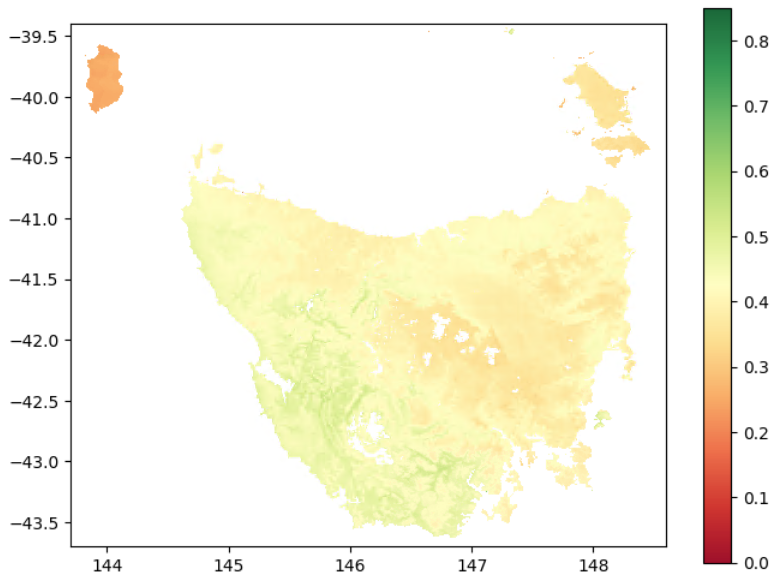

<h1><a name="top"></a>connectivity: a multi-resolution landscape connectivity algorithm</h1>

- [Installation ](#installation-)
  - [Create or Load a Python Environment ](#create-or-load-a-python-environment-)
  - [Compile and Install the Rust Library ](#compile-and-install-the-rust-library-)
- [Connectivity Analysis ](#connectivity-analysis-)
  - [Connected Habitat (Connectedness) ](#connected-habitat-connectedness-)
  - [PARC-Connectedness ](#parc-connectedness-)
  - [Bioclimatic Ecosystem Resilience Index (BERI) ](#bioclimatic-ecosystem-resilience-index-beri-)
- [Running Analysis with Tiles ](#running-analysis-with-tiles-)
      
A multi-resolution landscape connectivity algorithm for calculating ***Habitat Connectedness (Connected-Habitat)***, ***PARC Connectedness*** and the ***Bioclimatic Ecosystem Resilience Index (BERI)***.

This algorithm operates on the overview layers of raster files which are now generated on-the-fly.

## Installation <a name="install"></a>     
### Create or Load a Python Environment <a name="env"></a>     
You need to load the Python module and create an environment if you don't alreay have one. If you alrady have an envirnment with `rasterio`, `scipay` and `geopandas`, ignore this step and just activate your environment.

```bash
module load python/3.12.3
```

```bash
python -m venv ~/myenv
```
Installing the library into the environent:

```bash
source ~/myenv/bin/activate

# To make the virtual environment explicitly include system site packages, use:
python -m venv ~/myenv --system-site-packages
```

### Compile and Install the Rust Library <a name="rust"></a>     

1- Navigate to the repo:
```bash
cd ~/connectivity
```

2- Load the Rust module on HPC:

```bash
module load rust/1.92.0
```
For local installation, you need to install Rust on your system.

3- Complie and install the library:

Use the following to build a wheel:

```bash
maturin build --release
```

4- Install the wheel with `pip`:

```bash
pip install target/wheels/connectivity-*.whl
```

## Connectivity Analysis <a name="analysis"></a>     
To bound the spatial extent of the connectivity calculation, the algorithm limits how far it searches across neighboring cells in the condition raster. The maximum distance the algorithm searches for cells (in the condition raster) to calculate connectivity is computed as:
`max_distance = outer_window * max(levels) * resolution`. For example, with a 1 km resolution raster, a max-level of 32, and an `outer_window` of 11, the resulting search distance is:
      
```text
distance = outer_window × max_level × resolution
         = 11 × 32 × 1 km
         = 352 km  
```    

### Connected Habitat (Connectedness) <a name="conn"></a>    

To compute connected-habitat (or plain connectedness), you only need a habitat condition raster. Use `option` argument to generate the connected-habitat from connectedness and input condition with:    
1. `connectedness`
2. `connectedness * condition`
3. `sqrt(connectedness * condition)` — geometric mean (default)

```python
from connectivity import connectedness, beri, remove_grid_bias
```

```python
connd = connectedness(
    condition_file = "./data/condition.tif",
    lambdas = [2, 20, 200],
    max_cost = 2.0, 
    window_size = 5, 
    outer_window = 11,
    levels = [2, 4, 8, 16, 32], 
    option = 3,
    filename = "./results/connected_habitat.tif"
)
```



### PARC-Connectedness <a name="parc"></a>     
To compute PARC-connectedness, provide both:
* a habitat condition raster, and
* a protected-areas proportion raster.    
     
When `pa_file` (proportion of protected-areas in each cell) is supplied, the function automatically returns PARC-connectedness instead of standard connectedness.

```python
parcc = connectedness(
    condition_file = "./data/condition.tif",
    pa_file = "./data/pa_proportion.tif",
    lambdas = [2, 20, 200],
    max_cost = 2.0, 
    window_size = 5, 
    outer_window = 11,
    levels = [2, 4, 8, 16, 32], 
    filename = "./results/parc_connectedness.tif"
)
```



### Bioclimatic Ecosystem Resilience Index (BERI) <a name="beri"></a>    
To compute BERI, you must provide:
* a condition raster
* current GDM transgrids
* one or more future transgrids scenarios (as a list)

```python
beris = beri(
    condition_file = "./data/condition.tif",
    current_file = "./data/transgrids/1990.tif",
    future_files = ["./data/transgrids/IPS50_45.tif", "./data/transgrids/GFD50_85.tif"],
    lambdas = [2, 20, 200], 
    max_cost = 2.0, 
    window_size = 5, 
    outer_window = 11,
    levels = [2, 4, 8, 16, 32],
    filename = "./results/berri.tif"
)
```



## Running Analysis with Tiles <a name="tiles"></a>    

To run the model using tiles, you can supply a rectangular tile polygon as a GeoDataFrame to the `polygon_mask` argument. This limits data loading to only the portion required for the tile (i.e., the pixels within the tile plus a buffered neighborhood).

Be sure to set `closed_border = False` (the default) so that neighborhood information is included and edge effects are avoided in adjacent tiles. 

```python
import geopandas as gpd 

tiles = gpd.read_file(".data/tiles.gpkg")

tile_id = 0
tile_poly = tiles.iloc[[tile_id]]

connd = connectedness(
    condition_file = "./data/condition.tif",
    polygon_mask = tile_poly,
    closed_border = False,
    margin_px = 32,
    lambdas = [2, 20, 200],
    max_cost = 2.0, 
    window_size = 5, 
    outer_window = 11,
    levels = [2, 4, 8, 16, 32], 
    filter_kwargs = {"max_correction": 0.05},
    option = 1,
    filename = f"./results/connected_habitat_tile_{tile_id}.tif"
)
```

Increase `margin_px` to `64` if you see edge effects at tile joints. Tune `filter_kwargs` (for example `max_correction`, `periods`, `background_size`, `axis`, `block_strength`, `block_min_period_repeats`, or `max_block_periods`) if you still see excessive grid effects. Another useful solution is increasing tile overlap.

[Back to top!](#top)
